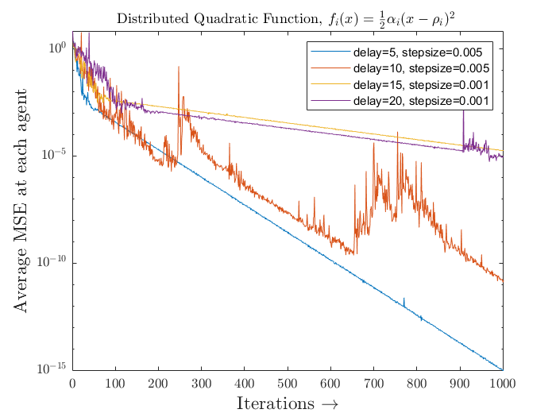
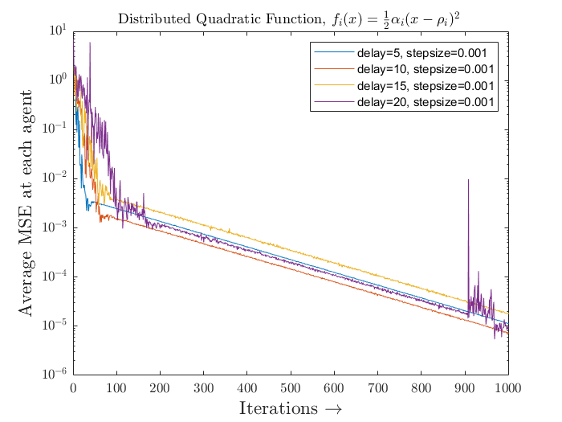
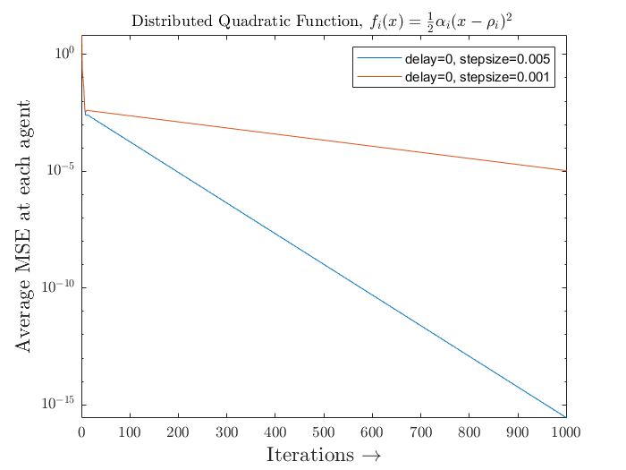

# Distributed Optimization: Asynchronous Networks

All the algorithms described here, implements consensus algorithms and achieves convergence for given distributed network.  These algorithms are focused on network with dealys i.e, some/all the agents are exchanging inforamtion at different time instances with dealys.  Also, the graph topology is time-variant.

## Algorithms

The following section describes which file does what in breif.

* [`async_appopt_delays.m`](async_appopt_delays.m) implements ADD-OPT consensus algorithm in asynchronous network setup (only delay networks)
* [`async_appopt_switchings.m`](async_appopt_switchings.m) implements ADD-OPT consensus algorithm in asynchronous network setup (only time-varying networks)
* [`async_frost_delays.m`](async_frost_delays.m) implements FROST consensus algorithm in asynchronous network setup (only delay networks)
* [`gen_aug_weight_matrix.m`](gen_aug_weight_matrix.m) function to generate weight matrix incase of network with delays
* [`gen_cs_aug_matrix.m`](gen_cs_aug_matrix.m) function to generate column-stoachastic weight matrix
* [`gen_rs_aug_matrix.m`](gen_rs_aug_matrix.m) function to generate row-stoachastic weight matrix
* [`gen_switching_weight_mat.m`](gen_switching_weight_mat.m) function to generate weight matrix incase of network with switchings
* [`pick_switching_weight_mat.m`](pick_switching_weight_mat.m) function to randomly choose time-varying weight matrix without repetation over a set interval

-------------------------------------------------------------------------------------------------------------------------------------------------------------------------
## Convergence Plots

In this secton, we show the convergence plots for all algorithms proposed in above section `Algorithms`

<!-- Asynchronous (with network delays) ADD-OPT consensus-->

  

-------------------------------------------------------------------------------------------------------------------------------------------------------------------------
## Residual plot

The following figure plots the comparision of average mean-square error for asynchronous ADD-OPT and FROST algorithms.

<!-- ADD-OPT - Residual plot comparision for 
                                           different step-size and delays -->

  
  

<!-- ADD-OPT - Residual plot comparision for different step-size -->

  

