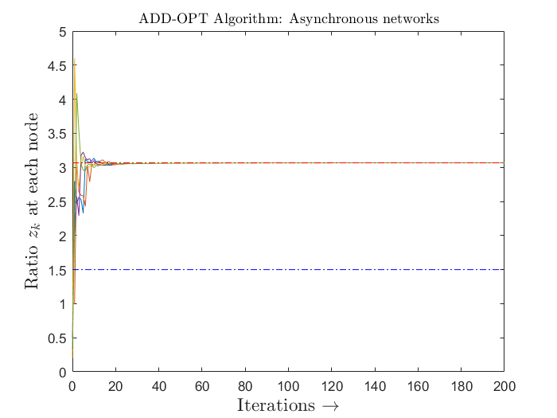

# Distributed Optimization: Asynchronous Networks

All the algorithms described here, implements consensus algorithms and achieves convergence for given distributed network.  These algorithms are focused on network with dealys i.e, some/all the agents are exchanging inforamtion at different time instances with dealys.  Also, the graph topology is time-variant.

## Algorithms

The following section describes which file does what in breif.

* [`async_appopt.m`](async_appopt.m) implements ADD-OPT consensus algorithm in asynchronous network setup
* [`aug_weight_matrix.m`](aug_weight_matrix.m) function to generate weight matrix incase of network delays

-------------------------------------------------------------------------------------------------------------------------------------------------------------------------
## Convergence Plots

In this secton, we show the convergence plots for all algorithms proposed in above section `Algorithms`

<!-- Asynchronous (with network delays) ADD-OPT consensus-->

  

-------------------------------------------------------------------------------------------------------------------------------------------------------------------------
## Residual plot

The following figure plots the comparision of average mean-square error between ADD-OPT and FROST algorithms.

