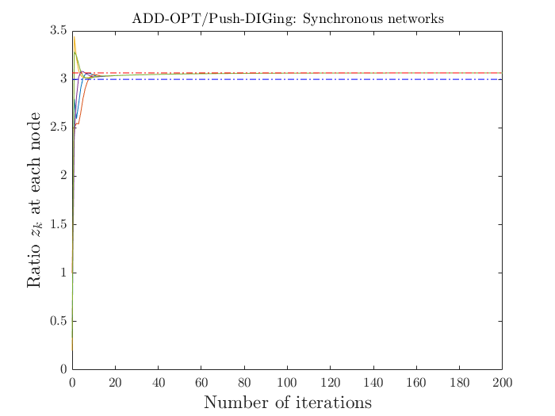
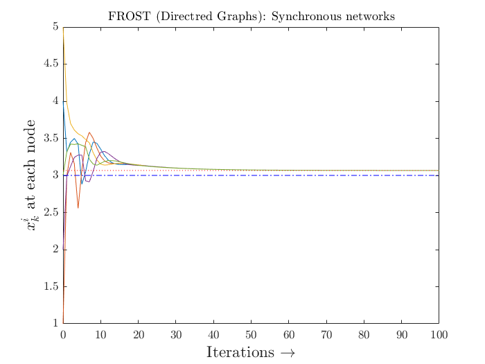
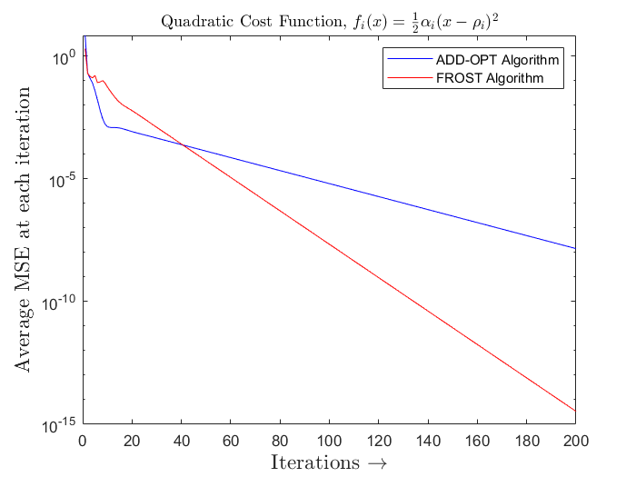

# Distributed Optimization: Synchronous Networks

All the algorithms described here, implements consensus algorithms and achieves convergence for given distributed network.  These algorithms are constrained to no-delay scenarious i.e, all the agents are assumed to comuunicate synchronously without any dealy in the information.  Also, the graph topology is time-invariant.

## Algorithms

The following section describes which file does what in breif.

* [`sync_pushsum.m`](sync_pushsum.m) implements pushsum consensus algorithm in synchronous network setup
* [`sync_subgradpush.m`](sync_subgradpush.m) implements subgradient push consensus algorithm in synchronous network setup
* [`sync_appopt.m`](sync_appopt.m) implements ADD-OPT consensus algorithm in synchronous network setup
* [`sync_projsubgrad.m`](sync_projsubgrad.m) implements projected subgradient consensus algorithm in synchronous network setup
* [`sync_frost.m`](sync_frost.m) implements FROST consensus algorithm in synchronous network setup
* [`compute_gradient.m`](compute_gradient) function handle to compute the gradient of function at x

-------------------------------------------------------------------------------------------------------------------------------------------------------------------------
## Convergence Plots

In this secton, we show the convergence plots for all algorithms proposed in above section `Algorithms`

<!-- Push sum consensus -->

  
  

  
  

-------------------------------------------------------------------------------------------------------------------------------------------------------------------------

## Residual Plots

The following figure plots the comparision of average mean-square error between ADD-OPT and FROST algorithms.

<!-- Residual plot comparision between ADD-OPT and FROST -->

  

