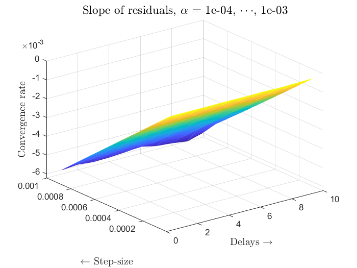
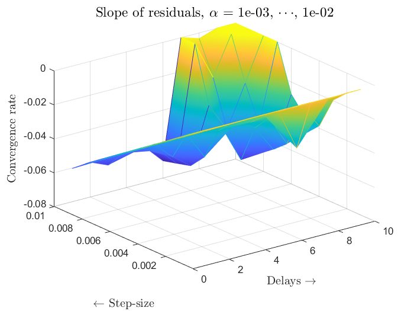
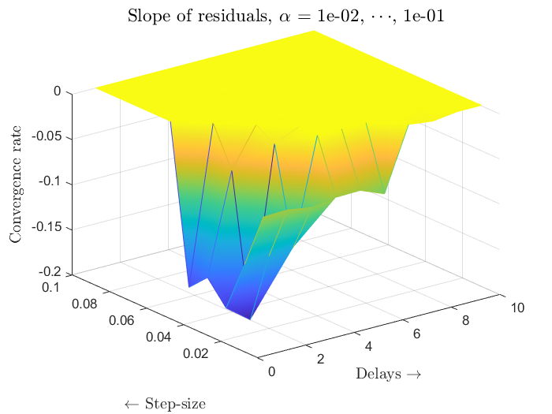

# Asynchronous ADD-OPT with Delay links in the network 

This folder contains test scripts for implementing ADD-OPT with delays for huge dataset with stepsizes varying from 0.0001 to 0.1 and each with delays between (1,10).

The respective logs for each case are stored in `test_logs` folder.

For example: `step_0_001` folder contains ADD-OPT delay implementation for each delay ranging from 1 to 10 as `.mat` file.  So. each folder stores 10 mat files for each dealy. In each test, the iterations are kept constant, i.e, 2000 iterations. 

-------------------------------------------------------------------------------------------------------------------------------------------------------------------------

## Instructions

Steps 1, and 2 are mandatory.  Steps-3,4,5 have to used according to the user interests.

**STEP-1:**  

*Use [combine_mat_files.m](combine_mat_files.m) to compile all mat files for each step-size.  For eg: All 10 files in `step_0_001` will be compiled into a single mat file, and stored in `test_logs/combined_logs` with name `compiledLog_step_0_001_itr_2000.mat`*
*The scripts automatically generates the output folder and saves compiled .mat files for all step-size with a single run.*

**STEP-2:**  

*Run [calculate_slope_of_residuals.m](calculate_slope_of_residuals.m) which computes the residual slopes for all test cases.  The result is stored to `assets/matvar` as `async_addopt_residuals_and_slopes.mat`*

**STEP-3:**  

*[plot2D_residual_for_every_step.m](plot2D_residual_for_every_step.m) script generates the residual comparison plots for each stepsize (A residual plot consists 10 semi-log plots representing residuals for all dealys).  Also, another linear plot displaying the slope of residual for each delay.*

**STEP-4:**  

*[plot3D_with_animation.m](plot3D_with_animation.m) are used to generate three graphs with delay, stepsize and convergence rate on X,Y, and Z respectively.  Also, svaes the figures as interactive vidoes in the root folder.  If animation is not required, use and [`plot3D_without_animation.m`](plot3D_without_animation.m).*

**NOTE: [CaptureFigVid.m](CaptureFigVid.m) converts figure to interactive video in MPEG-4 format.  I do not own the ownership of this file. Plese, refer to the information section in the file for issues and future suggestions.**

-------------------------------------------------------------------------------------------------------------------------------------------------------------------------
## 3D-Plots

The following plots are generated after executing `addopt_with_delays.m` with following parameters.

*Delays in the network = [1 2 3 4 5 6 7 8 9 10]*

*Stepsize = [0.0001  0.0002  0.0003  0.0004  0.0005  0.0006  0.0007  0.0008  0.0009  0.001  0.002  0.003  0.004  0.005  0.006  0.007  0.008  0.009  0.01  0.02  0.03  0.04  0.05  0.06  0.07  0.08  0.09  0.1]*

  
  

  

